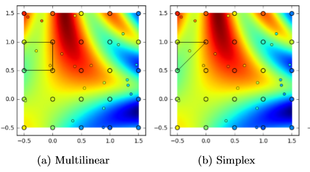

# GridInterpolations

[](https://travis-ci.org/sisl/GridInterpolations.jl)
[](https://coveralls.io/r/sisl/GridInterpolations.jl)

This package performs multivariate interpolation on a rectilinear grid. At the moment, it provides implementations of multilinear and simplex interpolation. It also provides facilities to perform unweighted k-nearest neighbor interpolation on the provided grid with the user's choice of distance metric.  As of benchmarks in December 2016, multilinear interpolation performs fastest and with the most accuracy.

The following image visualizes grid-based interpolation in two dimensions, with shape of interpolater for (−0.3,0.8) inscribed. The small dots reflect the interpolation's estimate for sin(x)+2cos(y)+sin(5xy), which is the underlying reward function approximated by the large dot lattice.



For a description of multilinear and simplex interpolation see: Scott Davies, _Multidimensional Triangulation and Interpolation for Reinforcement Learning_, Advances in Neural Information Processing Systems, Cambridge, MA: MIT Press, 1997. [pdf](http://papers.nips.cc/paper/1229-multidimensional-triangulation-and-interpolation-for-reinforcement-learning.pdf)

There are some related packages, such as [Grid.jl](https://github.com/timholy/Grid.jl) and [Interpolations.jl](https://github.com/tlycken/Interpolations.jl).  The fast k-NN implementation relies on the ball tree implementation in [NearestNeighbors.jl](https://github.com/KristofferC/NearestNeighbors.jl).

## Installation

Start Julia and run the following command:

```julia
Pkg.add("GridInterpolations")
```

## Usage

To use the GridInterpolations module, begin your code with

```julia
using GridInterpolations
```

## Interpolation

Create two-dimensional interpolation grids, a data array, and a point of interest:
```julia
grid = RectangleGrid([0., 0.5, 1.],[0., 0.5, 1.])  	# rectangular grid
sGrid = SimplexGrid([0., 0.5, 1.],[0., 0.5, 1.])	# simplex grid
kGrid = KnnFastGrid(3, [0., 0.5, 1.],[0., 0.5, 1.])	# 3-nearest neighbor using ball trees from NearestNeighbors.jl 
kGridNaive = KnnGrid(3,[0., 0.5, 1.],[0., 0.5, 1.])	# 3-nearest neighbor using naive implementation 
# KnnGrid has low 1-NN overhead for 10k+ points but worse computational complexity 
# than KnnFastGrid outside the case of a large number of points with k=1
gridData = [8., 1., 6., 3., 5., 7., 4., 9., 2.]   	# vector of value data at each cut
x = [0.25, 0.75]  									# point at which to perform interpolation
```

Perform interpolation on the rectangular grid:
```julia
julia> interpolate(grid,gridData,x)
5.25
```

Or interpolate on the simplex grid:
```julia
julia> interpolate(sGrid,gridData,x)
6.0
```

Compute interpolants for the grids:
```julia
julia> sGrid = SimplexGrid([0., 0.5, 1.],[0., 0.5, 1.])
[[0.0,0.5,1.0],[0.0,0.5,1.0]]

julia> interpolants(sGrid, x)
([4,5,8],[0.5,0.0,0.5])
```

Convert an index to a Grid coordinate:
```julia
julia> ind2x(grid, 3)
2-element Array{Float64,1}:
 1.0
 0.0
```

Number of vertices in the grid:
```julia
julia> length(grid)
9
```

Number of dimensions:
```julia
julia> dimensions(grid)
2
```

## Credits

Contributors to this package include Maxim Egorov, Eric Mueller, and Mykel Kochenderfer.
